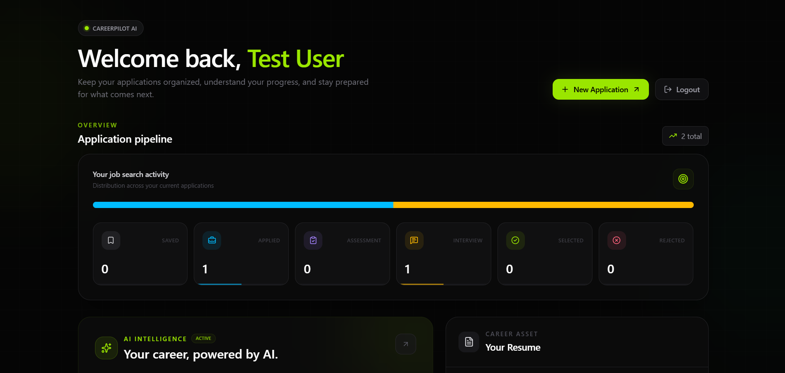
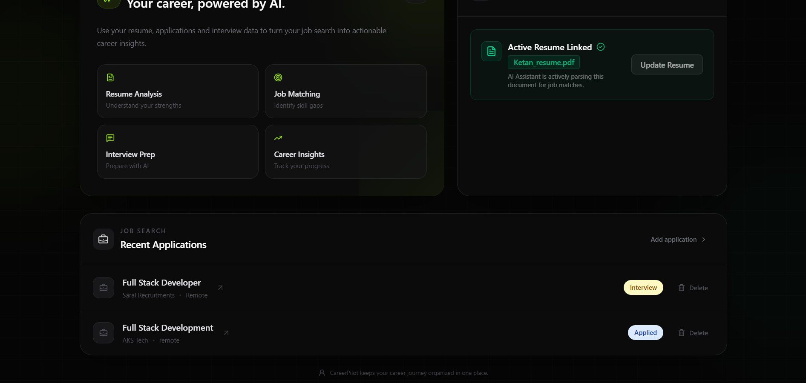
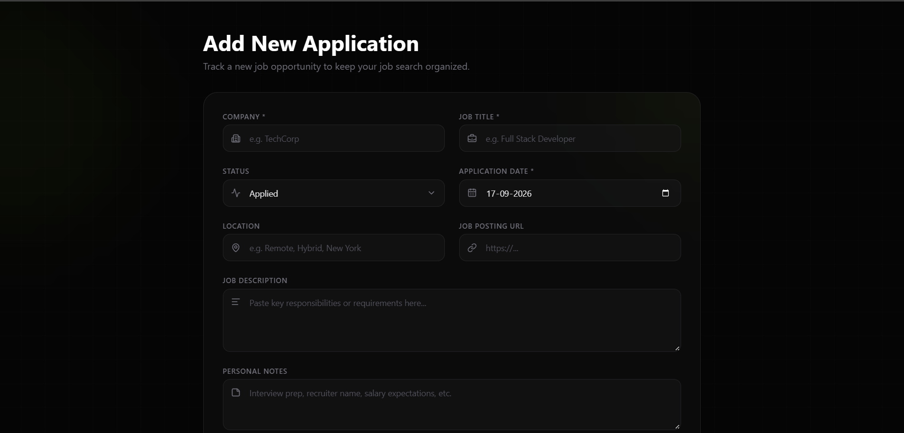
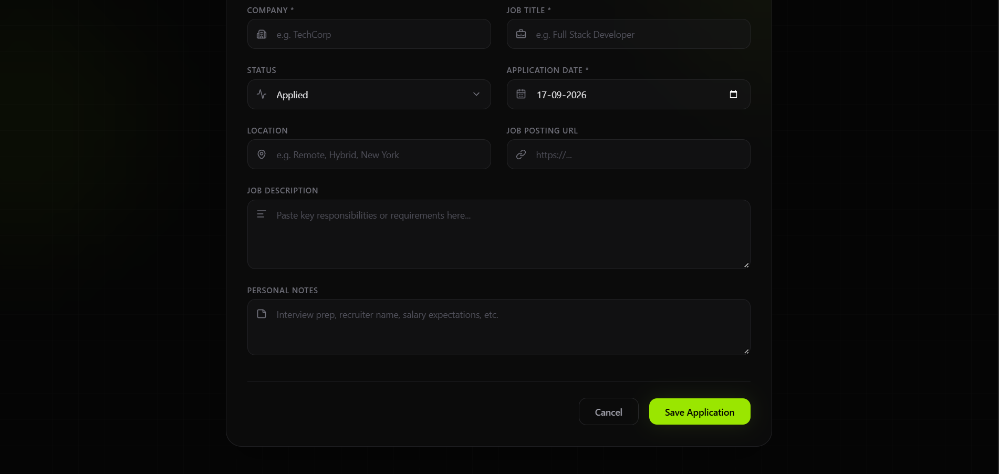
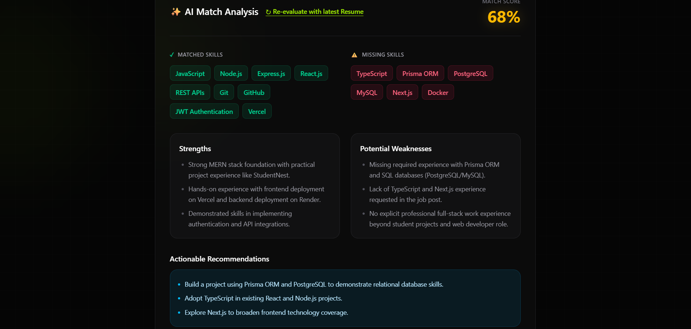
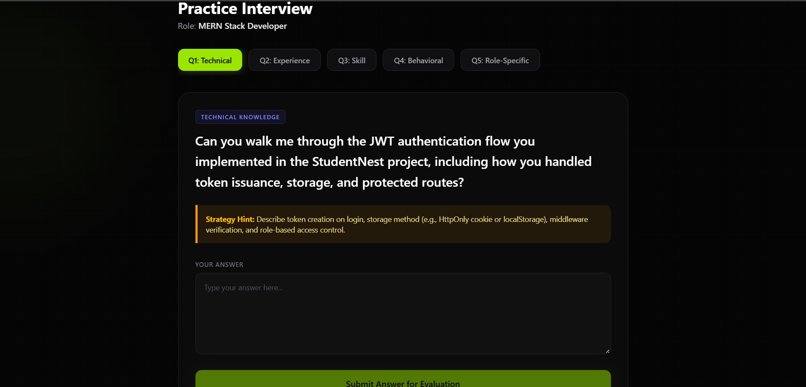

# CareerPilot

> **AI-powered job application tracking and interview preparation platform built with the MERN stack.**

CareerPilot helps job seekers manage applications, store and analyze resumes, compare their profile against job requirements, identify skill gaps, and prepare for interviews with AI-powered feedback.

The project is built as a practical full-stack portfolio project with a focus on secure authentication, user-specific data ownership, resume processing, cloud file storage, AI integration, and a modern SaaS-style interface.

---

## ✨ Features

- 🔐 **Secure Authentication** — JWT-based authentication with HTTP-only cookies
- 📋 **Application Tracking** — Create, view, edit, and delete job applications
- 📊 **Application Analytics** — Track application status and career activity from the dashboard
- 📄 **Resume Management** — Upload PDF resumes and extract their text for analysis
- ☁️ **Cloud Resume Storage** — Resume files are stored using Cloudinary
- 🤖 **AI Job Match Analysis** — Compare resume content with a target role
- 🎯 **Skill Gap Analysis** — Identify matched skills, missing skills, strengths, weaknesses, and recommendations
- 🧠 **AI Interview Preparation** — Generate exactly five role-specific interview questions
- 💬 **AI Answer Evaluation** — Get structured feedback and a score on interview answers
- 🛡️ **User Data Isolation** — Backend ownership checks protect user-specific applications, resumes, and interview data
- 📱 **Responsive UI** — Designed for desktop, laptop, tablet, and mobile experiences

---

## 📸 Screenshots

### Dashboard



### Dashboard — AI & Applications



### Application Form



### Application Form — Additional Details



### AI Match Analysis



### Practice Interview



---

## 🛠️ Tech Stack

### Frontend

- React
- Vite
- React Router
- Axios
- Tailwind CSS
- Lucide React

### Backend

- Node.js
- Express
- MongoDB
- Mongoose
- JWT
- bcryptjs
- cookie-parser
- CORS
- Multer
- Cloudinary
- PDF text extraction

### AI

- **Groq API**
- **Model:** `openai/gpt-oss-120b`
- Structured JSON generation and application-side validation

### Deployment Target

- Frontend — Vercel
- Backend — Render
- Database — MongoDB
- File Storage — Cloudinary
- AI — Groq

> Deployment links will be added after the production deployment is completed.

---

## 🏗️ Architecture

```text
                         CareerPilot
                              │
                 ┌────────────┴────────────┐
                 │                         │
          React + Vite                Express API
                 │                         │
              Axios                Controllers / Routes
                 │                         │
          React Router                    │
                 │                  Services / Middleware
                 │                         │
                 └────────────┬────────────┘
                              │
          ┌───────────────────┼────────────────────┐
          │                   │                    │
       MongoDB            Cloudinary              Groq
          │                   │                    │
   User/Application       Resume PDFs       AI Analysis /
   Interview Data                           Interview Prep
```

The backend is organized around routes, controllers, services, middleware, and Mongoose models. AI-specific logic is kept in the AI service instead of being scattered throughout controllers.

---

## 🤖 AI Workflow

CareerPilot uses Groq with the `openai/gpt-oss-120b` model for its AI features.

### 1. Application Analysis

The application analyzer uses:

- Candidate resume text
- Target job title
- Job description

It produces structured insights including:

- Match score
- Matched skills
- Missing skills
- Strengths
- Weaknesses
- Recommendations

The analysis is validated before being stored with the application.

### 2. Interview Question Generation

Interview preparation combines:

- Resume information
- Job description
- Previous AI match analysis

The system generates exactly five questions across these categories:

1. Technical Knowledge
2. Experience & Projects
3. Skill Gap / Weakness
4. Behavioral
5. Role-Specific Requirement

Each question also includes a strategy hint to help the candidate structure an answer without simply giving them the answer.

### 3. Interview Answer Evaluation

Submitted answers are evaluated against the interview question, intended strategy, and target role.

The evaluation provides:

- Score from 0–10
- Strengths
- Weaknesses
- Actionable feedback

AI output is validated on the backend before it is returned to the client.

---

## 🔐 Authentication & Security

CareerPilot uses JWT authentication with HTTP-only cookies.

### Authentication flow

```text
User Login
    ↓
Backend validates credentials
    ↓
JWT generated
    ↓
JWT stored in HTTP-only cookie
    ↓
Protected requests include cookie
    ↓
Auth middleware verifies JWT
    ↓
User identity is used for authorization
```

### Security decisions

- JWT is not stored in `localStorage`.
- Authentication cookies are HTTP-only.
- Protected routes use authentication middleware.
- User-owned resources are queried using both the resource ID and authenticated user ID.
- User-supplied user IDs are not trusted for authorization.
- AI-related API credentials remain backend-only.
- Resume files are processed in memory before being uploaded to Cloudinary.

---

## 📂 Project Structure

```text
CareerPilot/
│
├── client/
│   ├── src/
│   │   ├── components/
│   │   ├── context/
│   │   ├── pages/
│   │   ├── services/
│   │   ├── App.jsx
│   │   └── main.jsx
│   └── package.json
│
├── server/
│   ├── config/
│   ├── controllers/
│   ├── middleware/
│   ├── models/
│   ├── routes/
│   ├── services/
│   ├── server.js
│   └── package.json
│
├── docs/
│   └── screenshots/
│
├── .gitignore
└── README.md
```

---

## ⚙️ Environment Variables

Create a `.env` file inside the `server` directory.

```env
PORT=5000
MONGO_URI=your_mongodb_connection_string
FRONTEND_URL=http://localhost:5173
JWT_SECRET=your_jwt_secret

CLOUDINARY_CLOUD_NAME=your_cloudinary_cloud_name
CLOUDINARY_API_KEY=your_cloudinary_api_key
CLOUDINARY_API_SECRET=your_cloudinary_api_secret

GROQ_API_KEY=your_groq_api_key
```

For the frontend, configure the backend API URL through a Vite environment variable when required by the deployment setup:

```env
VITE_API_URL=http://localhost:5000/api
```

**Never commit real secrets or `.env` files to GitHub.**

---

## 🚀 Getting Started

### Prerequisites

Make sure you have:

- Node.js installed
- MongoDB available locally or a MongoDB connection string
- A Cloudinary account
- A Groq API key

### 1. Clone the repository

```bash
git clone <your-repository-url>
cd CareerPilot
```

### 2. Install backend dependencies

```bash
cd server
npm install
```

Configure `server/.env` before starting the backend.

### 3. Start the backend

Development:

```bash
npm run dev
```

Production-style start:

```bash
npm start
```

### 4. Install frontend dependencies

Open another terminal:

```bash
cd client
npm install
```

### 5. Start the frontend

```bash
npm run dev
```

The Vite development server will provide the local frontend URL in the terminal.

---

## 🔌 API Overview

### Authentication

| Method | Endpoint | Purpose |
|---|---|---|
| POST | `/api/auth/register` | Register a user |
| POST | `/api/auth/login` | Log in |
| POST | `/api/auth/logout` | Log out |
| GET | `/api/auth/me` | Get authenticated user |

### Applications

| Method | Endpoint | Purpose |
|---|---|---|
| POST | `/api/applications` | Create application |
| GET | `/api/applications` | Get user's applications |
| GET | `/api/applications/stats` | Get application statistics |
| GET | `/api/applications/:id` | Get application |
| PUT | `/api/applications/:id` | Update application |
| DELETE | `/api/applications/:id` | Delete application |

### Resume

| Method | Endpoint | Purpose |
|---|---|---|
| POST | `/api/resume/upload` | Upload and process a resume |

### AI

| Method | Endpoint | Purpose |
|---|---|---|
| POST | `/api/ai/applications/:id/analyze` | Analyze resume/job match |
| POST | `/api/ai/interview-questions` | Generate interview questions |
| POST | `/api/ai/evaluate-answer` | Evaluate an interview answer |
| GET | `/api/interviews` | Get user's interviews |
| GET | `/api/interviews/:id` | Get an interview |

### Health Check

```text
GET /api/health
```

Returns the API health status.

---

## 🧠 Technical Decisions

### HTTP-only JWT Cookies

JWT authentication uses HTTP-only cookies instead of storing tokens in `localStorage`. This keeps the token inaccessible to client-side JavaScript and fits the application's cookie-based authentication flow.

### Resource Ownership

User-owned resources are protected at the database-query level by checking the authenticated user's identity along with the requested resource ID.

### Memory-Based Resume Uploads

Multer memory storage is used so uploaded PDFs do not need to be unnecessarily written to the server filesystem. The file can be processed and uploaded to Cloudinary as part of the request flow.

### AI Service Separation

AI-related logic is kept inside a dedicated service layer. Controllers are responsible for request/response handling while the service handles AI-specific processing and validation.

### AI Output Validation

AI output is treated as untrusted data. Returned JSON is parsed and validated before it is stored or returned to the frontend.

### Prompt Injection Awareness

Resume text, job descriptions, and user interview answers are treated as untrusted input during AI processing. Prompts explicitly instruct the model to treat those values as data rather than executable instructions.

---

## 🛡️ AI Failure Handling

AI services can fail because of rate limits, authentication/configuration problems, temporary provider errors, or malformed output.

CareerPilot handles these cases by:

- Returning user-friendly errors
- Validating AI output
- Preserving existing application data
- Avoiding unnecessary exposure of raw provider errors
- Allowing the user to retry AI operations

The application is designed so that temporary AI availability issues do not destroy existing career-tracking data.

---

## 🎨 UI Design

CareerPilot follows a dark, modern SaaS visual identity inspired by a **"Neural Flow"** aesthetic.

The interface uses:

- Near-black backgrounds
- Dark layered cards
- Lime and emerald accents
- Subtle ambient glows
- Zinc borders and typography
- Rounded cards
- Responsive layouts
- Lucide icons
- Restrained animations and shadows

The goal is to keep the interface visually modern while maintaining usability and readability.

---

## 🧪 Testing Checklist

Before production deployment, the application should be tested across:

- Registration and login
- Session persistence
- Logout
- Application CRUD
- Application ownership
- Resume upload and extraction
- AI analysis
- AI rate-limit/error states
- Interview generation
- Interview answer evaluation
- Unauthorized resource access
- Responsive layouts
- Production CORS and cookies

---

## 🚀 Deployment

Planned production architecture:

```text
Frontend  → Vercel
Backend   → Render
Database  → MongoDB
Files     → Cloudinary
AI        → Groq
```

Production environment variables and authentication/CORS configuration should be verified after deployment.

Live demo and deployment links will be added once the application is deployed.

---

## 🔮 Future Improvements

Potential future improvements include:

- Job search/import integrations
- More detailed application analytics
- Additional interview modes
- Resume version management
- Richer career insights
- Production monitoring and observability

These are intentionally kept outside the current core scope so the existing application can remain focused and maintainable.

---

## 🎯 Project Goal

CareerPilot was built as an internship-focused portfolio project to demonstrate practical experience with:

- Full-stack MERN development
- REST API design
- Authentication and authorization
- MongoDB data modeling
- File upload and PDF processing
- Cloud storage integration
- AI API integration
- Structured AI outputs
- Error handling
- Responsive SaaS UI development

---

## 👨‍💻 Author

**Ketan Jaiswal**

Built as a full-stack AI career management project.

---

## 📄 License

This project is currently intended as a portfolio project. Add a specific open-source license here if you decide to publish the repository under one.
